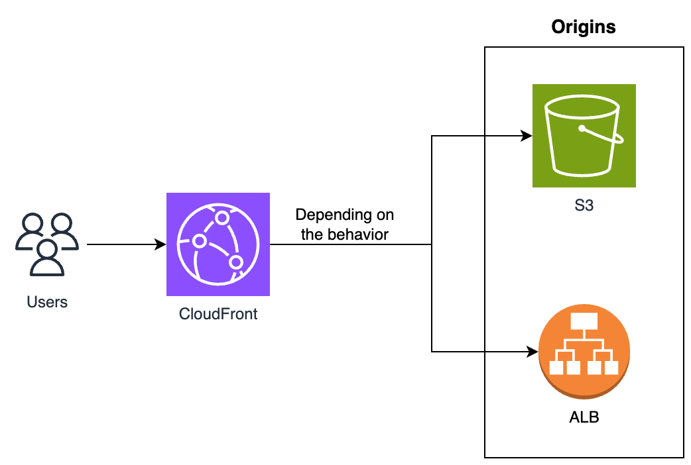

### Check out my article on "Host a static website using AWS CloudFront with S3 & ALB as origins"
https://medium.com/@kennyangjy/host-a-static-website-using-aws-cloudfront-with-s3-alb-as-origins-9c68255bd72c

---
> *Caution:* Cost will be involved in creating these resources. For more information, do visit the relavent resource pricing pages as it differs from region to region.
- https://aws.amazon.com/elasticloadbalancing/pricing/
- https://aws.amazon.com/ec2/pricing/
---

### To provision the resources in this repository:
1. `git clone https://github.com/Kenny-AngJY/Medium-3.git`
2. If you have an ACM certificate in the us-east-1 region and a public Route53 hosted zone. You can modify the default value of the 3 variables below in [./variables.tf](https://github.com/Kenny-AngJY/Medium-3/blob/main/variables.tf)
  > - acm_certificate_arn
  > - hosted_zone_name
  > - hosted_zone_id
3. `terraform init`
4. `terraform plan`  
If you left the "acm_certificate_arn" variable empty, there should be 27 resources to be created. Else, 28 resources to be created.
5. `terraform apply`  
As no backend is defined, the default backend will be local.

### Clean-up
1. `terraform destroy`
